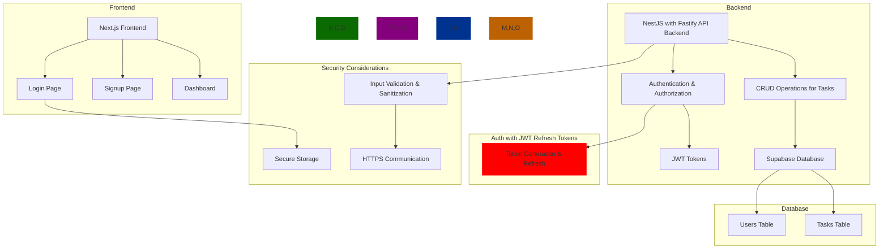

# Schedule

### Backend

- [ ] pnpm workspace
- [ ] monorepo (Turborepo or Nx?)
- [ ] Nestjs
- [ ] logging with Pino
- [ ] Swagger for API documentation
- [ ] testing with Jest
- [ ] Fastify
- [ ] GraphQL
- [ ] API versioning
- [ ] Drizzle
- [ ] Supabase (database, auth, storage)
- [ ] KeyDB/Dragonfly cache (Redis alternative)
- [ ] rate limiting with KeyDB/Dragonfly
- [ ] Memphis.dev (queue alternative to Kafka/Bullmq/RabbitMQ, ...)
- [ ] ElectricSQL as localfirst sync integraded with Supabase

---

### Frontend

- [ ] Next.js
- [ ] TailwindCSS
- [ ] Shadcn
- [ ] Auth JWT with action token and refresh token

---

### Base, repo, automation

- [ ] CI/CD (Github Actions)
- [ ] linting, etc... and Biome
- [ ] Storybook
- [ ] Dockerize

---

### Models / CRUD

- [ ] Users
- [ ] Workspaces
- [ ] Tasks
- [ ] Projects
- [ ] Notes
- [ ] Timesheets
- [ ] Toast notifications
- [ ] Realtime updates
- [ ] Websockets???????
- [ ] App updates with git hash versioning

---

### Schema

---

### Links & information

- [Rokas Dam](https://github.com/devRokas)
- [Rokas Dam nestjs starter - Nestjs + Supabase (no fastify, no drizzle, no auth)](https://github.com/devRokas/supabase-nestjs-rest-api-starter-kit)
- [Sakura Dev - video 1: Nestjs with Prisma and Nextauth](https://www.youtube.com/watch?v=khNwrFJ-Xqs)
- [Sakura Dev - Video 2: refactoring Nestjs with Drizzle](https://www.youtube.com/watch?v=l1DGXmmgZ9w)
- [NestJS](https://nestjs.com/)
- [Fastify](https://www.fastify.io/)
- [Pino](https://getpino.io/)
- [Memphis.dev](https://memphis.dev/)
- [KeyDB](https://keydb.dev/)
- [Dragonfly](https://dragonflydb.com/)
- [Supabase](https://supabase.io/)
- [ElectricSQL](https://electricsql.com/)
- [ElectricSQL integration Supabase](https://supabase.com/partners/integrations/electricsql)
- [Shadcn](https://shadcn.com/)
- [Drizzleorm](https://drizzleorm.com/)
- [pnpm](https://pnpm.io/)
